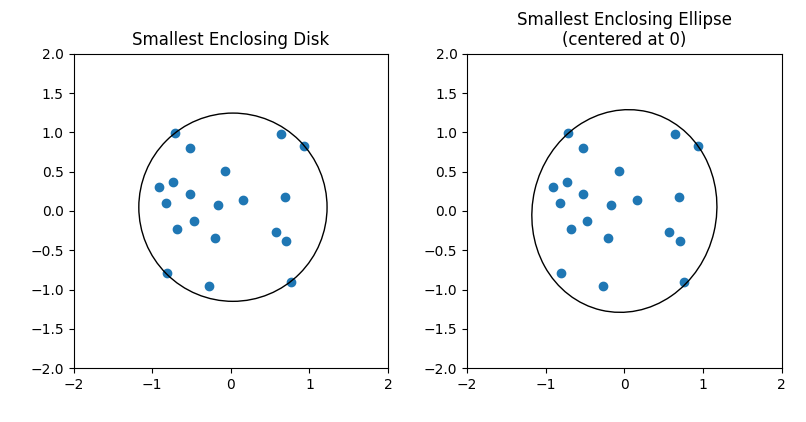

# Implementation of Welzl's MINIDISK Algorithm
> Welzl, Emo (1991), "Smallest enclosing disks (balls and ellipsoids)", in Maurer, H. (ed.), New Results and New Trends in Computer Science, Lecture Notes in Computer Science, vol. 555, Springer-Verlag, pp. 359—370, CiteSeerX 10.1.1.46.1450

- `minidisk.py` : algorithm to find the Smallest Enclosing Disk of a point cloud\
    **Note**: the circle is given in a custom `Circle` object, `demo.py` show how you can convert this matrix to a `matplotlib.patches.Circle` object
- `miniellipse.py` : algorithm to find the Smallest Enclosing Ellipse centered at [0,0] of a point cloud\
    **Note**: the ellipse is given in its matrix representation, `demo.py` show how you can convert this matrix to a `matplotlib.patches.Ellipse` object
